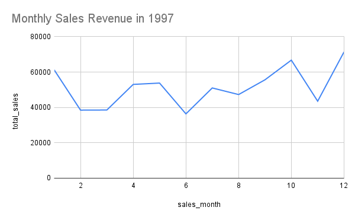

# E-commerce Sales Analysis using SQL

## Project Goal
The goal of this project is to analyze the Northwind database using SQL to identify key business insights related to sales performance, top products, employees, and customers.

***

## Tools Used
* **Database:** PostgreSQL
* **SQL Client:** DBeaver
* **Version Control:** Git & GitHub

***

## SQL Analysis & Findings

### 1. What are the best-selling products?
* **Finding:** The analysis reveals a key difference between sales volume and sales value. By total **quantity sold**, the top product is "Camembert Pierrot". However, when analyzing by total **sales revenue**, the most valuable product is "Côte de Blaye". This insight shows that our highest revenue-generating products are not necessarily the ones we sell most often.
* **Script:** [`01_top_10_products.sql`](./sql_scripts/01_top_10_products.sql)

---

### 2. Who are the top-performing sales representatives?
* **Finding:** Margaret Peacock is the top-performing sales representative by a significant margin, generating the most revenue for the company, followed by Janet Leverling.
* **Script:** [`02_top_5_employees.sql`](./sql_scripts/02_top_5_employees.sql)

---

### 3. What was the monthly sales trend for 1997?
* **Finding:** Sales in 1997 followed a clear seasonal trend. They started slow in the first quarter and grew steadily throughout the year, reaching a peak in the final quarter.
* **Script:** [`03_monthly_sales_1997.sql`](./sql_scripts/03_monthly_sales_1997.sql)

---

### 4. Who are the most valuable customers?
* **Finding:** Our most valuable customers by total spending are primarily located in Germany and Austria. The top two companies, "QUICK-Stop" and "Ernst Handel", are responsible for a substantial portion of total revenue, making them key accounts for retention efforts.
* **Script:** [`04_top_5_customers.sql`](./sql_scripts/04_top_5_customers.sql)

---

### Visualization
* **Finding:** The chart below clearly visualizes the sales growth throughout 1997, confirming the trend of a slow start followed by a strong finish in the holiday season.

